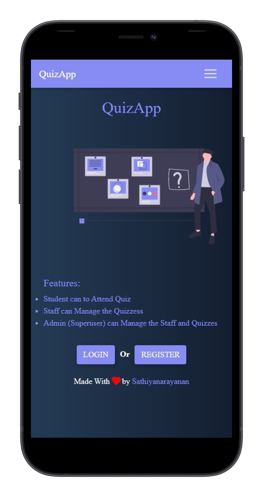

# Quizsoft

> A Quiz app for Students using Django.
<p align="center">
    <a href="https://quizsoft.herokuapp.com/" target="_blank">
        
        
    </a>
</p>
<br/>

## Features
-  Admin (superuser) can manage staff, students and quizzes.
-  Staff can manage the quizzes
- students can attend the quizzes and see the score they get for corresponding quizzes.

<br/>


## Getting started
Clone this repository:
```sh
$ git clone git@github.com:Sathiyanarayanan-M/quizApp_django.git
```

Add os environments on `settings.py`

```sh
os.environ['SECRET_KEY'] = 'your secret key'
os.environ['MONGODB_URI'] = 'your mongodb url'
```
<br/>

Install all packages using `pip`

```sh
$ pip install -r requirements.txt
```
<br/>

Run this project on server

```sh
$ python manage.py runserver
```
<br/>


## Feedback 
Any questions or suggestions?

You are welcome to discuss it on:

[](https://twitter.com/sathiya1622)
